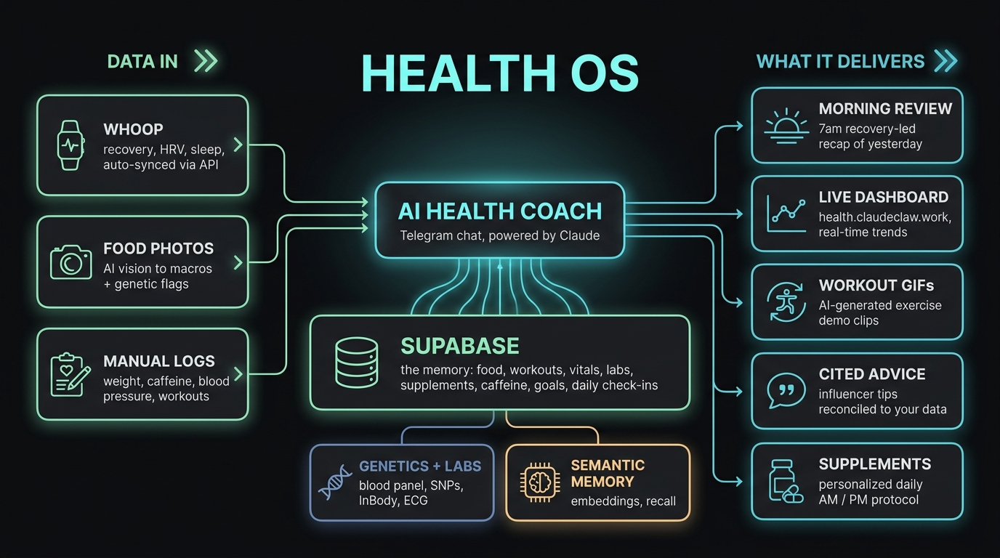
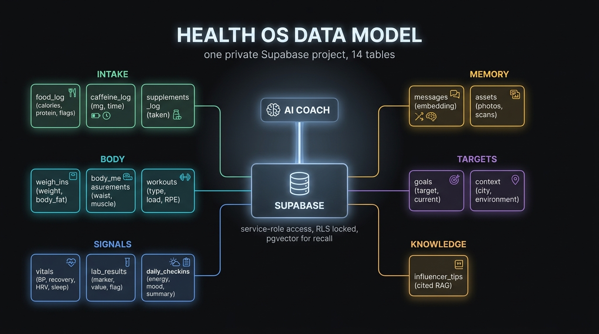
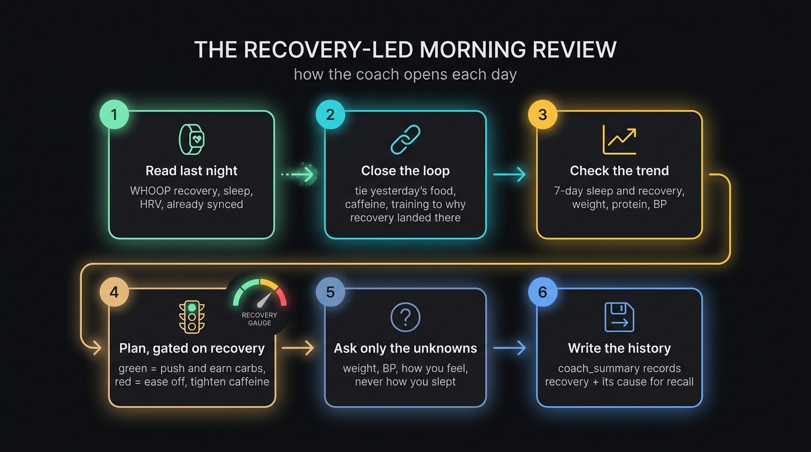
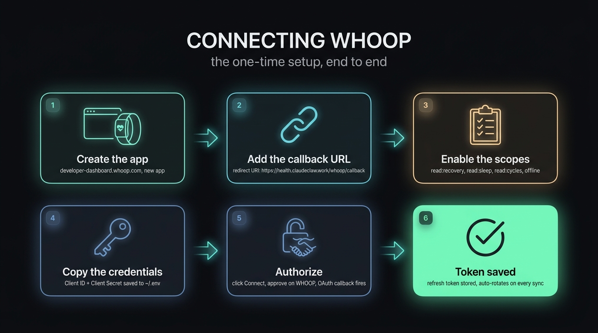
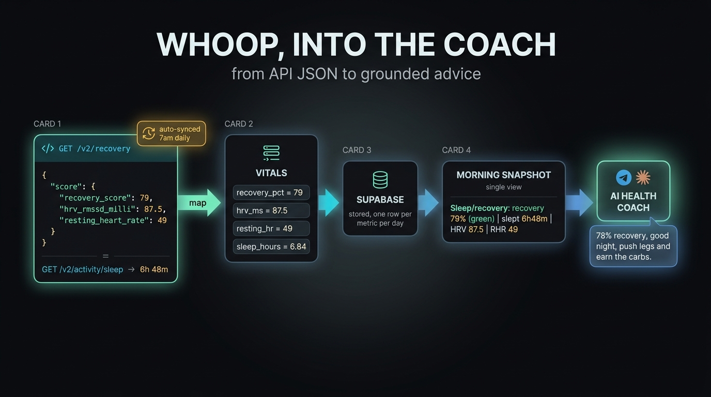

# Health OS

A complete, turnkey blueprint for a **personal AI health coach**: a Telegram agent that remembers everything in its own Supabase database, reads your wearable (WHOOP) over the official API, runs a recovery-led morning review, and grounds every call in your real bloods, genetics, body composition, and goals.

Clone it, point it at your own Supabase project and bot token, work through the checklist below, and you have a coach that reviews yesterday, reads last night's recovery, and tells you whether to push or pull today.



> Everything in this repo is generic or an example. It contains **no personal health information**. Bring your own data, bot, and Supabase project. Keep your filled-in `CLAUDE.md`, your seed values, and your `~/.env` out of version control.

---

## What you get

- **A Telegram health coach** grounded in your data, not generic advice.
- **Its own Supabase database** (full schema in `agent/supabase/migrations/`): food, workouts, weigh-ins, body comp, caffeine, supplements, vitals, labs, daily check-ins, goals, context, plus semantic message memory.
- **A WHOOP connection blueprint** end to end: OAuth app, the redirect/callback, the daily sync, the JSON-to-database mapping, and the two production gotchas (Cloudflare user-agent, refresh-token rotation).
- **A recovery-led morning review** that ties yesterday's food/caffeine/training to how you recovered, and gates today's plan on the number.
- **Photo workflows** (food -> macros, lab scan -> markers, body photo -> workout).
- **All the diagrams** generated to convey the system, embedded throughout.

---

## Architecture

The agent reads a compact **session snapshot** at the start of every turn (weight trend, today's intake, BP, last night's recovery, the 7-day sleep pattern, goals), so it always answers from current context. Data flows in from the wearable, food photos, and manual logs into Supabase; the coach reasons over it, grounded in your labs and genetics; and it delivers the morning review, the dashboard, cited advice, and supplement schedules.



The recovery-led morning review the coach runs each day:



See the full map above. The repo layout:

```
health-os-private/
├── README.md                  ← you are here (overview + the test checklist)
├── docs/
│   ├── BUILD_GUIDE.md         ← step-by-step build, end to end
│   ├── health-os-schematic.png
│   ├── whoop-1-setup.png
│   └── whoop-2-data.png
└── agent/                     ← the self-contained, sanitized agent
    ├── CLAUDE.md              ← the coach's brain (template, fill in your profile)
    ├── agent.yaml.example     ← bot config + slash commands
    ├── AGENTS.md
    ├── scripts/               ← state, memory, db, WHOOP, supplements, advice, ...
    └── supabase/migrations/   ← the full schema + example seed
```

---

## The WHOOP connection (the headline blueprint)

### One-time setup


### Data path: API JSON to coach


Full walkthrough in [`docs/BUILD_GUIDE.md`](./docs/BUILD_GUIDE.md). The short version: create a WHOOP app, register `https://<your-host>/whoop/callback`, enable `read:recovery read:sleep read:cycles offline`, authorize once, and a daily cron (`agent/scripts/whoop-sync.py`) pulls recovery + sleep into the `vitals` table. It rotates the refresh token every run and sends a browser user-agent (Cloudflare bans the default Python one).

---

## Quick start

1. Provision a private Supabase project; push `agent/supabase/migrations/`.
2. Create a private `health-assets` storage bucket.
3. Fill `~/.env` (Supabase keys, `OPENAI_API_KEY`, `GOOGLE_API_KEY`, your `HEALTH_BOT_TOKEN`, and `WHOOP_CLIENT_ID/SECRET`).
4. Create a Telegram bot via @BotFather; set `telegram_bot_token_env` in `agent.yaml`.
5. Copy `CLAUDE.md` and fill in your own profile.
6. Connect WHOOP (one-time OAuth). Schedule the sync + the morning check-in.

Full detail: [`docs/BUILD_GUIDE.md`](./docs/BUILD_GUIDE.md).

---

## Validation checklist

Work top to bottom. Check each box once you have personally verified it on your own setup.

### Supabase + schema
- [ ] Private Supabase project provisioned in an appropriate region
- [ ] `pgvector` extension enabled (the `0001_init.sql` migration does this)
- [ ] All migrations pushed; all 14 tables exist
- [ ] RLS enabled on every table, no policies (anon key reads nothing)
- [ ] Private `health-assets` storage bucket created
- [ ] Example seed replaced with your own goals + context (`0002_seed_example.sql`)
- [ ] `scripts/db.py select goals` returns your rows

### Agent + Telegram
- [ ] Bot created via @BotFather, token in `~/.env`
- [ ] Agent boots and responds to a plain message in Telegram
- [ ] Slash commands appear in the "/" menu (`/checkin`, `/today`, `/sofar`, `/newday`, `/supplements`, `/advice`)
- [ ] `CLAUDE.md` filled in with your real profile (goal, bloods, genetics, constraints)
- [ ] `state.py` snapshot prints your weight, intake, and goals

### Logging
- [ ] A food photo is read and written to `food_log` with macros + flags
- [ ] A weight message writes a `weigh_ins` row
- [ ] A workout / caffeine / supplement message writes its row
- [ ] A BP reading writes a `vitals` row
- [ ] A lab scan extracts markers into `lab_results`
- [ ] Semantic recall (`mem.py recall`) returns relevant past messages

### WHOOP
- [ ] WHOOP developer app created; scopes enabled
- [ ] Redirect URI registered exactly and saved
- [ ] One-time OAuth completed; `WHOOP_REFRESH_TOKEN` written to `~/.env`
- [ ] `whoop-sync.py` runs and writes `recovery_pct`, `hrv_ms`, `resting_hr`, `sleep_hours`
- [ ] Re-running the sync is idempotent (no duplicate rows for a day)
- [ ] The cron is scheduled and fires in the morning
- [ ] Token rotation verified (a second run still succeeds, no `invalid_grant`)
- [ ] Browser user-agent confirmed (no Cloudflare 1010 error)

### Coaching behavior
- [ ] Morning check-in fires and opens with last night's recovery
- [ ] The check-in ties yesterday's choices to the recovery number
- [ ] Today's plan is visibly gated on recovery (green = push, red = ease off)
- [ ] On-demand "should I eat this given how I slept" pulls recovery and leads with it
- [ ] `coach_summary` records the recovery + its cause (history accrues)
- [ ] The 7-day sleep/recovery trend shows in the snapshot

### Optional
- [ ] Live trends dashboard reachable and showing the Sleep & Recovery card
- [ ] Workout demo clip generation works (`exercise_clip.py`)
- [ ] Influencer advice RAG returns cited tips reconciled to your data

---

## Privacy

This is sensitive data. The Supabase project is private and locked down (service-role server-side, no anon policies). Keep your real `CLAUDE.md`, seed values, photos, and `~/.env` out of git. This repo is the scrubbed blueprint, not anyone's records.
